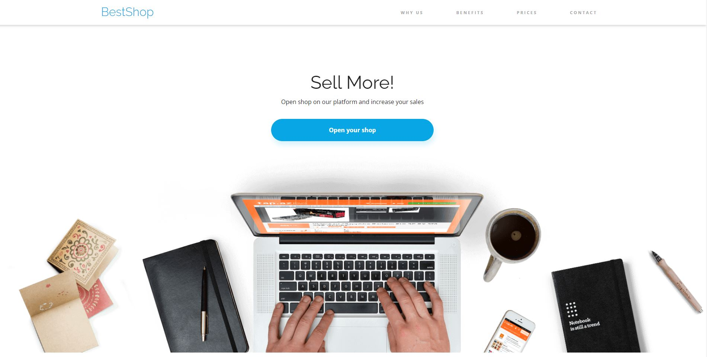
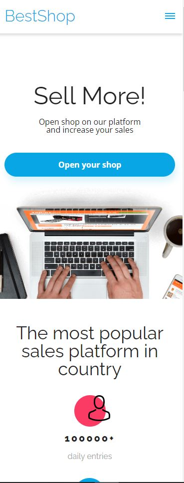
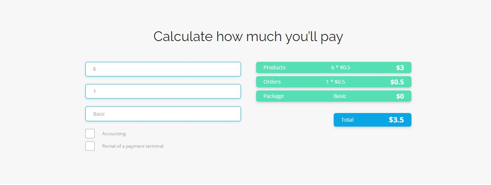

<a href='https://bestschop.netlify.app'>Podgląd strony</a>

Aplikacja skupia się na umiejętnym wykorzystywaniu funkcjonalności JavaScript i SCSS. 
W projekcie została wykorzystana wiedza w zakresie CSS/SCSS.
Odwzorowanie szablonu przygotowanego w Figma przez szkolę CodersLab. 
Aplikacja przygotowana jest do korzystania z niej na urządzeniach mobilnych (RWD)

Głównym elementem projektu jest kalkulator zliczający  automatycznie i na bieżąco wszystkie dostępne usługi i ich wyświetlaniu.

